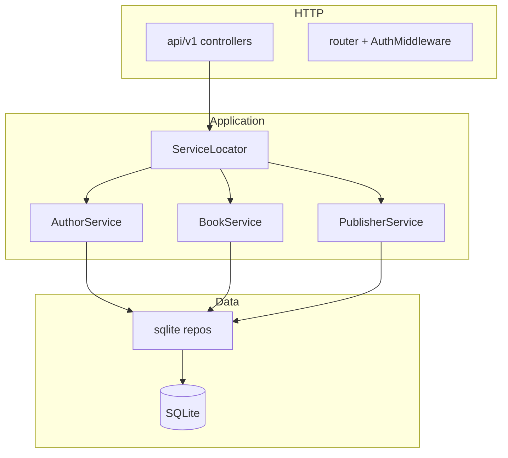
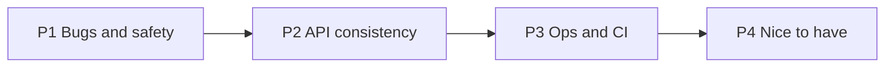

# Codebase improvement audit

A prioritized audit of the library-api interview project: what works well, confirmed bugs and risks, and concrete improvements across API, services, data layer, tests, and operations.

## Architecture snapshot



The layered design (controller → `iservices` → service → repo → DB) is clear and interview-friendly. Most improvements are about **hardening edge cases**, **consistency**, and **production readiness**—not rewriting the architecture.

---

## What is already good

| Area | Why it works |
|------|----------------|
| **Layering** | Thin controllers; business rules in [`services/`](../services/); SQL only in [`data/sqlite/`](../data/sqlite/). |
| **Testability** | Repo interfaces defined by consumers; hand-rolled [`mock/repo`](../mock/repo) and [`mock/iservices`](../mock/iservices). |
| **Filtering** | [`models/filter.go`](../models/filter.go) whitelists columns via `FilterFieldMap()` — values are parameterized. |
| **Book PATCH race (Task 4)** | [`BookService.Update`](../services/book_service.go) + [`UpdateWithOptimisticLock`](../data/sqlite/book_repo.go) with `WHERE id = ? AND updatedAt = ?` and 409 on `RowsAffected == 0`. |
| **Author delete guard** | [`AuthorService.Delete`](../services/author_service.go) blocks delete when books still reference the author. |
| **Includes** | Batch `ListByIDs` in [`BookService.includes`](../services/book_service.go) — avoids N+1 on list/get. |
| **Transfer books** | Single `UPDATE` in [`TransferBooks`](../data/sqlite/book_repo.go) — atomic at SQL statement level. |
| **Central errors** | [`ErrorHandler`](../api/v1/router.go) keeps controllers free of status mapping. |
| **Tests** | Solid happy-path E2E ([`api/v1/api_test.go`](../api/v1/api_test.go)) + focused service unit tests; Task 4 covered in [`book_update_test.go`](../services/book_update_test.go) and [`book_repo_test.go`](../data/sqlite/book_repo_test.go). |

---

## Confirmed bugs and high-risk issues

### 1. Bulk delete SQL breaks for join-based filters (High)

[`BulkSoftDelete`](../data/sqlite/book_repo.go) reuses `buildBookWhere` but the `UPDATE` has **no** `LEFT JOIN authors`:

```go
q := `UPDATE books SET state = ?, ...
    ` + strings.Replace(where, "WHERE ", "WHERE ", 1) // passthrough
```

Filters like `author.name` (used in [`TestFilterByAuthorName`](../api/v1/api_test.go)) work on **List** because [`bookFrom`](../data/sqlite/book_repo.go) joins authors — but bulk delete with the same filter will fail at runtime (`no such column: authors.name`). The `strings.Replace` is a no-op.

**Fix direction:** Use a subquery (`WHERE books.id IN (SELECT books.id FROM books LEFT JOIN authors ... WHERE ...)`) or duplicate join logic for bulk UPDATE.

### 2. Empty bulk-delete filter deletes all active books (High)

With `{}` body, `buildBookWhere` still adds `books.state = 'active'`. [`BookService.BulkDelete`](../services/book_service.go) and [`bulkDelete` controller](../api/v1/book_controller.go) do not require a non-empty filter.

**Fix direction:** Reject empty `filter` in service or controller; optional `confirm: true` flag for destructive ops.

### 3. Foreign keys off in production (Medium)

[`sqlite.Open`](../data/sqlite/db.go) does not enable `PRAGMA foreign_keys=ON`. Tests use `_pragma=foreign_keys(1)` in [`api_test.go`](../api/v1/api_test.go); [`main.go`](../cmd/server/main.go) does not — invalid FK references may persist.

### 4. `$in` filter likely broken for JSON arrays (Medium)

[`filter.go`](../models/filter.go) type-asserts `[]any`; `encoding/json` often unmarshals arrays as `[]interface{}` in some paths — worth verifying and fixing with a small type switch or helper.

### 5. Invalid filter errors return 500 (Medium)

Filter build errors are plain `fmt.Errorf`; [`ErrorHandler`](../api/v1/router.go) only maps `*HTTPError` → clients see **500** instead of **400** for bad `?filter=` / bulk body.

### 6. Author/Publisher updates still last-write-wins (Medium)

Only **books** use optimistic locking. [`AuthorService.Update`](../services/author_service.go) and [`PublisherService.Update`](../services/publisher_service.go) use read-modify-write + plain `Update` — same class of race Task 4 fixed for books.

### 7. PATCH wipes omitted fields (Medium)

[`BookService.Update`](../services/book_service.go) always assigns `Title`, `ISBN`, `PageCount`, `Genre` from body — a PATCH with only `title` clears other fields to zero/empty. Relations are handled better (nil = skip).

---

## Security and operational gaps

| Issue | Location | Notes |
|-------|----------|-------|
| **Spoofable auth** | [`AuthMiddleware`](../api/v1/router.go) | Any client sets `X-User-Id`; documented stub, not production-safe. |
| **`X-User-Id` overflow** | [`router.go`](../api/v1/router.go) | Manual digit loop vs `strconv.ParseInt` in `pathID`. |
| **No authorization** | All services | Audit fields only; no ownership/role checks. |
| **`MustGetSession` panics** | [`models/session.go`](../models/session.go) | Route without auth → 500 via Recover. |
| **Bind errors leak internals** | Controllers | `"invalid body: "+err.Error()` exposes binder details. |
| **No graceful shutdown** | [`cmd/server/main.go`](../cmd/server/main.go) | `e.Start` only; no `Shutdown` on SIGTERM. |
| **No CI / `.gitignore`** | Repo root | `library.db` can be committed; no automated `go test -race`. |
| **Health check shallow** | `main.go` `/healthz` | Static JSON; no DB ping; not covered in tests. |

---

## Inconsistencies and API design friction

- **404 vs 400** for missing related entities: transfer source → 404, target → 400; book FK missing → 400.
- **Publisher delete** has no “books still reference publisher” check (authors do).
- **Double `Context` in handlers**: `h.svc.Book(ctx).List(ctx, args)` — redundant; locator ignores ctx.
- **Create-then-Get**: successful write can be followed by failed Get → confusing response after insert.
- **Silent invalid `orderBy`**: [`buildOrderBy`](../data/sqlite/sql_helpers.go) falls back to default column with no 400.
- **Task 2 gap**: `orderBy=author.name` mentioned in [`INTERVIEW_TASKS.md`](../INTERVIEW_TASKS.md) — filter tested; **sort not tested** in `*_test.go`.
- **Transfer returns 204** with no count of moved books.
- **Test vs prod wiring drift**: `newTestServer` omits Recover, Logger, `/healthz` present in `main.go`.

---

## Data layer and schema improvements

| Topic | Detail |
|-------|--------|
| **Migrations** | [`db.go`](../data/sqlite/db.go): redundant `ALTER publishers_id` with ignored error; no transactional migrate. |
| **Indexes** | Missing on `authors.name`, `books.genre` (heavy filter use in tests). |
| **Constraints** | No `UNIQUE` on `books.isbn`; nullable FKs without documented `ON DELETE` behavior. |
| **Timestamps** | Optimistic lock assumes `updatedAt` is set; NULL breaks `WHERE updatedAt = ?`. |

---

## Testing gaps (by priority)

**Add soon**

- Bulk delete with `author.name` filter (would catch bug #1 today).
- `orderBy=author.name` integration test (Task 2 completeness).
- Bulk delete with empty filter → expect 400.
- API test: concurrent PATCH → one 200, one 409 (optional; may need barrier or retries).
- `?hardDelete=true` on at least one resource.
- Check `json.Unmarshal` errors in [`api_test.go`](../api/v1/api_test.go) instead of `_ = json.Unmarshal`.

**Add later**

- Unit tests for [`models/filter.go`](../models/filter.go) (`SQL`, `$in`, invalid op).
- Repo tests: `TransferBooks`, `BulkSoftDelete` (happy path), `author_repo` / `publisher_repo` list filters.
- `AuthMiddleware` invalid header cases.
- `go test -race ./...` in CI.

---

## Recommended improvement roadmap



**P1 — Correctness and safety**

1. Fix `BulkSoftDelete` for join filters (subquery or JOIN).
2. Require non-empty filter (or explicit confirm) on bulk delete.
3. Enable `foreign_keys` in [`sqlite.Open`](../data/sqlite/db.go).
4. Map filter/validation errors to 400 in services or `ErrorHandler`.

**P2 — Consistency and UX**

5. PATCH merge semantics (only update fields present in JSON) for book/author/publisher.
6. Optimistic locking (or ETag) for author/publisher updates.
7. Publisher delete: check for referencing books.
8. Align 404/400 for “referenced entity not found”.
9. Parse `X-User-Id` with `strconv.ParseInt`.

**P3 — Operations and quality**

10. Add `.gitignore` (`library.db`, binaries).
11. GitHub Actions: `go test ./...`, `-race`, optional `staticcheck`.
12. Graceful shutdown + DB ping on `/healthz`.
13. Document `LIBRARY_ADDR` in README; add `.env.example`.

**P4 — Polish**

14. `Location` header on 201 Created.
15. Transfer response body with moved count.
16. Indexes on `authors.name`, `books.genre`.
17. Remove no-op `strings.Replace` in bulk delete; clean migration story for `publishers_id`.

---

## Improvement backlog (trackable)

| ID | Priority | Task |
|----|----------|------|
| fix-bulk-delete-sql | P1 | Fix BulkSoftDelete to support join-based filters (e.g. author.name) via subquery or JOIN |
| guard-bulk-delete | P1 | Reject empty filter on DELETE /v1/books (service + controller) |
| enable-fk-pragma | P1 | Enable PRAGMA foreign_keys=ON in sqlite.Open and align test DSNs |
| map-filter-errors-400 | P1 | Translate filter/SQL build errors to HTTP 400 in services or ErrorHandler |
| patch-merge-semantics | P2 | PATCH only updates fields present in JSON body across resources |
| extend-optimistic-lock | P2 | Add updatedAt locking to author/publisher Update paths |
| add-critical-tests | P2 | Tests: bulk delete author.name, empty filter 400, orderBy=author.name, hardDelete |
| ops-ci-gitignore | P3 | Add .gitignore, CI workflow with go test -race, graceful shutdown, healthz DB ping |

---

## Summary

The project is **well-structured for an interview codebase** and interview tasks are largely implemented with sensible patterns. The main gaps are not architectural—they are **edge-case correctness** (bulk delete + join filters, empty bulk filter), **inconsistent hardening** (only books have optimistic locking), and **production hygiene** (auth stub, no CI, FK pragma, PATCH semantics). Addressing P1 items gives the highest return before expanding test coverage and ops tooling.
